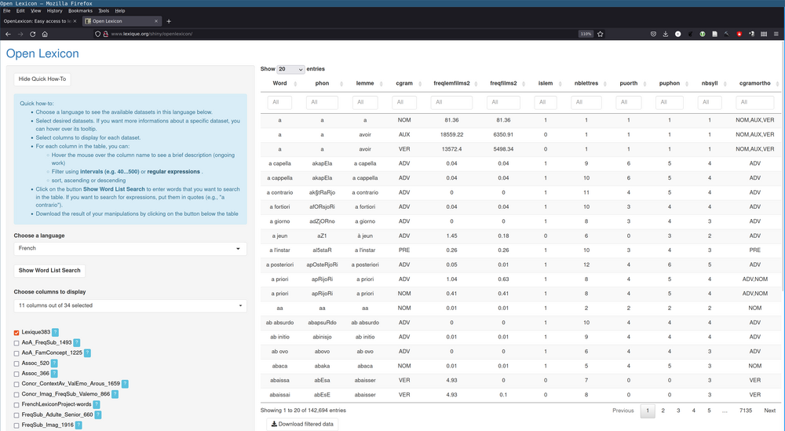

# OpenLexicon: Easy access to lexical databases

 <http://chrplr.github.io/openlexicon> 

  

**Click [here](http://www.lexique.org/shiny/openlexicon) if you want to use the *Openlexicon App*  **

You will find here:

1. A [directory of lexical databases](datasets-info/README.md)
2. [Scripts](https://github.com/chrplr/openlexicon/tree/master/scripts) to query, manipulate or create lexical databases.
3. [Apps](https://github.com/chrplr/openlexicon/tree/master/apps/) to create dynamic graphical interfaces to the lexical databases, e.g. <http://www.lexique.org/shiny/openlexicon>. 
4. [Documents](https://github.com/chrplr/openlexicon/tree/master/documents/) of interest related to the processing of lexical resources. 

Source codes are available at <http://github.com/chrplr/openlexicon>.

## Downloading a database to work locally (on your computer)

You can download datasets directly from the links provided in the README file associated to each database. For example:

* in Python:

        import pandas as pd
        lex = pd.read_csv('http://www.lexique.org/databases/Lexique383/Lexique383.tsv', sep='\t')
        lex.head()

* in R:

        library(readr)
        lex = read_tsv('http://www.lexique.org/databases/Lexique383/Lexique383.tsv')
        head(lex)
    

    
However, in R, there is a better way. You should use the [R dataset fetcher](https://raw.githubusercontent.com/chrplr/openlexicon/master/datasets-info/fetch_datasets.R), which has several advantages:
- it avoids having to specify the location of the dataset on the web
- it will always point to the latest version of a dataset if it has been updated
- it provides a caching mechanism: the dataset will be downloaded only if necessary, otherwise a local copy will be used.
- it checks the sumfile of the dataset to make sure that you have the correct version.

For example, to download the table of Lexique383:

    require(tidyverse)
    require(rjson)
    source('https://raw.githubusercontent.com/chrplr/openlexicon/master/datasets-info/fetch_datasets.R')
    lexique383 <- get_lexique383()

### For maintainers only ###

- [How-to-install-a-new-dataset](datasets-info/README-how-to-install-a-new-database.md)
- [Server installation](README-server-installation.md)

### Contributing ###

Everybody is warmly encouraged to contribute, by adding new databases (To add a new dataset, you must create a `.json` file in `datasets-info/_json`. Check out [How-to-install-a-new-dataset](datasets-info/README-how-to-install-a-new-database.md)), an app, or a script.

First, check out Lexique's google-group at <https://groups.google.com/forum/#!forum/lexiqueorg>.  You can then contact `christophe@pallier.org` and `boris.new@gmail.com` privately, or, _much better_, fork the 
[openlexicon](https://github.com/chrplr/openlexicon) repository (see [How to fork a repo](https://help.github.com/en/articles/fork-a-repo)) and issue a pull request (see [Creating a pull request from a fork](https://help.github.com/en/articles/creating-a-pull-request-from-a-fork)).

## TODO ##

Check out the [TODO list](TODO.md)

### Crediting ###

Most databases have associated publications listed in their respective `README`
files. They must be cited in any derivative work! The same goes for some of the
scripts (read their documentation for instructions).

The main contributors to the openlexicon project are [Christophe Pallier](http://www.pallier.org), [Boris New](https://psycho-usmb.fr/boris.new/) and Jessica Bourdini (TODO: add link to your page, Jessica).

To cite this repository, use the following reference:

* Pallier, Christophe & New, Boris &  Jessica Bourdin (2019) Openlexicon, GitHub repository, <https://github.com/chrplr/openlexicon>

### License ###

The files in this repository are distributed under a CC BY-SA 4.0 LICENSE (see
<https://creativecommons.org/licenses/by-sa/4.0/>).

---

Time-stamp: <2019-10-05 09:48:32 christophe@pallier.org>

