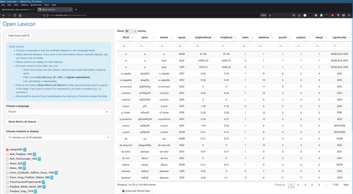
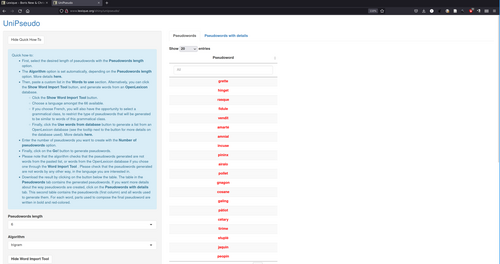

# OpenLexicon: Easy access to lexical databases

Homepage: <http://chrplr.github.io/openlexicon>

**If all you want is to access the *[Openlexicon App](http://www.lexique.org/shiny/openlexicon)* (lexical search)or the *[UniPseudo App](http://www.lexique.org/shiny/unipseudo)* (pseudoword generator), click on one of the screenshots below**

|  |  |

This site provides:

1. A [directory of lexical databases](datasets-info/README.md)
2. [Scripts](https://github.com/chrplr/openlexicon/tree/master/scripts) to download and query lexical databases.
3. [Apps](https://github.com/chrplr/openlexicon/tree/master/apps/) to create dynamic graphical interfaces to the lexical databases. Some of these apps are running at <http://www.lexique.org>
4. [Documents](https://github.com/chrplr/openlexicon/tree/master/documents/) of related to the processing of lexical resources.

The source code is available at <http://github.com/chrplr/openlexicon>.

Unless otherwise explained by a individual readme or license file in a directory, it distributed under a [CC BY-SA 4.0 LICENSE](https://creativecommons.org/licenses/by-sa/4.0/).

### Crediting ###

The main contributors to the openlexicon project are [Christophe Pallier](http://www.pallier.org), [Boris New](https://psycho-usmb.fr/boris.new/) and [Jessica Bourgin](https://jbourgin.github.io/).

To cite this repository, use the following reference:

* Pallier, Christophe & New, Boris &  Jessica Bourgin (2019) Openlexicon, GitHub repository, <https://github.com/chrplr/openlexicon>

Most databases have associated publications listed in their respective `README` files. They must be cited in any derivative work! The same goes for some of the scripts (read their documentation for instructions).

### Contributing ###

Everybody is warmly encouraged to contribute by submitting issues or by adding a new app, script, or databases (To add a new dataset, you must create a `.json` file in `datasets-info/_json`. Check out [How-to-install-a-new-dataset](datasets-info/README-how-to-install-a-new-database.md)).

First, check out Lexique's google-group at <https://groups.google.com/forum/#!forum/lexiqueorg>.  You can then contact `christophe@pallier.org` and `boris.new@gmail.com` privately, or, _much better_, fork the
[openlexicon](https://github.com/chrplr/openlexicon) repository (see [How to fork a repo](https://help.github.com/en/articles/fork-a-repo)) and issue a pull request (see [Creating a pull request from a fork](https://help.github.com/en/articles/creating-a-pull-request-from-a-fork)).

## TODO ##

Check out the [TODO list](TODO.md)

### For maintainers ###

- [How-to-install-a-new-dataset](datasets-info/README-how-to-install-a-new-database.md)
- [Server installation](README-server-installation.md)

---

Time-stamp: <2023-04-03 09:48:32 christophe@pallier.org>
