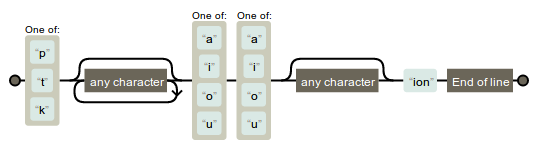

## Introduction

Ce document montre comment interroger et manipuler la base [Lexique](http://www.lexique.org) en [R](https://fr.wikipedia.org/wiki/R_(langage)) 

Il fait parti du cours [Programmation pour les Sciences Cognitives](https://chrplr.github.io/PCBS/). Merci de signaler d'éventuelles erreurs à <christophe@pallier.org>


## Préparation

1. S'ils ne sont pas déjà installés sur votre ordinateur, vous devrez installer les logiciels [R](https://cran.r-project.org/) et  [R-Studio Desktop](https://www.rstudio.com/products/rstudio/#Desktop).

2. Télécharger <http://www.lexique.org/databases/Lexique382/Lexique382.zip>

3. Créer un répertoire `Lexique` puis dézipper dans ce répertoire le fichier `Lexique382.zip` précédemment téléchargé.

4. Démarrer le programme **Rstudio** 

   - Sélectionner le menu `File/New Project`; 
   - Choisir "Existing directory" et naviguer jusqu'au répertoire `Lexique` que vous venez de créer; cliquer sur le bouton `create project`. 
   - Dans la fenêtre en bas à droite, parmi la liste des fichiers listés sous l'onglet *Files*, il doit apparaitre `Lexique382.tsv`. Si tel n'est pas le cas, vérifiez que vous avez bien suivi les instructions.

5. Dans la fenêtre en bas à gauche de Rstudio, dans l'onglet *Console*, copier la ligne suivante puis appuyez sur 'Entrée'

```
    install.packages('tidyverse')
```

Laissez rstudio se débrouiller (mais vous devrez peut-être sélectionner un serveur). Quand il a fini, vous êtes prêt ! Vous n'aurez plus jamais à refaire ces étapes.

## Chargement de la table "Lexique.org"

Tout se déroule dans Rstudio. Assurez vous de bien travailler dans le projet "lexique" créé dans la section "préparation". Après un redémarrage de rstudio, utilisez le menu `File/Recent Projects` pour retrouver ce projet.

- Cliquez le menu "File / New File / R Notebook". Un document "Untitled" apparait dans le fenetre en haut à gauche. 
- C'est dans ce document que nous allons entrer du code R:

  Déplacez vous à la ligne 5 (juste après la ligne contenant '---'), et cliquez sur le bouton *Insert* puis choisisez *R* (vous pouvez aller plus vite en appuyant sur *Ctrl+Alt+I*). 
  
  Copiez les trois lignes suivantes dans le bloc de code qui vient d'être créé. 

```{r}
    require(tidyverse)  # you must have ran "install.packages('tidyverse')" earlier
    lexique = read_delim("Lexique382.tsv", delim="\t")
    head(lexique, 25)
```

   Puis, en faisant bien attention que le curseur soit à l'intérieur du bloc de code, cliquer sur *Run / Run current chunk* (ou bien appuyer sur la petite *fleche verte*, ou sur *Ctrl-Shift-Enter*). Vous devriez voir les premières lignes de la table lexique s'afficher. Celle doit également apparaitre dans l'onglet "Environment" en haut à droite. 


Conseil: Lorsque vous quitterez rstudio, acceptez la proposition "sauvegarder le worskpace". Ainsi, la prochaine fois que vous ouvrirez le projet 'lexique' dans rstudio, la table sera déjà présente dans l'environnement, et il ne sera donc pas nécessaire d'exécuter les lignes ci-dessus (`read_delim`...).


## Sélection de mots entiers

Supposons que vous vouliez extraire les lignes de la table lexique correspondant, par exemple, aux mots 'bateau', 'avion', 'maison', 'arbre'. Le code suivant fait précisemment cela:


```{r}
items <- c('bateau', 'avion', 'maison', 'arbre')

selection <- subset(lexique, ortho %in% items)

head(selection)
```

Vous pouvez inspecter le contenu de la table `selection` en cliquant sur son nom dans l'onglet *Environment* situé dans la fenetre en haut à droite de rstudio.


Vous pouvez également sauvegarder les résultats obtenus dans un fichier,  avec la commande suivante:

```{r}
write_tsv(selection, 'selection.tsv')
```

Notez que les fichiers ayant l'extension `csv` (tab-separated-values) peuvent être [ouverts avec Excel](https://rievent.zendesk.com/hc/en-us/articles/360000029172-FAQ-How-do-I-open-a-tsv-file-in-Excel-), ou OpenOffice Cal, ou même avec n'importe quel éditeur de texte. Note: le package `readr` de R fournit aussi des fonctions `write_excel_csv` et `write_excel_csv2` qui peuvent intéresser certains.

Si vous avez une liste de mots plus longues, il serait fastidieux d'écrire la ligne `items <- ...`. Plus simplement vous pouvez utiliser:

```{r}
items = scan(what='characters')
```

Et copier la liste de mots. Entrer une ligne vide termine le processus. 

La fonction `scan` permet aussi de lire la liste dans un fichier externe.

## Sélection par critères

Supposons que vous vouliez sélectionner tous les noms de 5 lettres, singuliers, de fréquence lexicale (films) comprise entre 10 et 100. Voici la ligne magique:

```{r}
selection = subset(lexique, cgram=='NOM' & nombre != 'p' & nblettres==5 & freqlivres > 10 & freqlivres < 100)
head(selection)
```

## Sélection par "pattern"

### Les expressions régulières

Les expressions réulières, ou **regex**, sont des “patterns” qui permettent de rechercher des mots ayant certaines propriétés. Par exemple n'importe `a.b` désigne un mot contenant un `a` et un `b` séparés par une lettre quelonque. Voici d'autre exemples:

- **`^maison$`** : recherche le mot “maison” exactement
- **`^anti`** : recherche tous les mots commençant par “anti”
- **`^jour$|^nuit$|^matin$|^soir$`** : “jour” ou “nuit” ou “matin” ou “soir” (permet de rechercher une liste de mots)
- **`ion`** : recherche les mots qui contiennent la chaine “ion” dans n’importe quelle position
- **`ion$`** : mots se terminant par “ion”
- **`^pr`** : mots commençant par “pr”
- **`^p..r`$** : mots de quatre lettres commençant par “p”, finisant pas “r”
- **`^p.*r$`** : mots commencant par ‘”p’ et finissant par “r”
- **`[aeiou][aeiou]`** : mots contenant 2 voyelles successives
- **`^[aeiou]`** : mots commençant par une voyelle
- **`^[^aeriou]`** : mots ne commençant pas par une voyelle

Il existe de nombreux tutoriaux sur les regex sur le web, notamment [celui-ci](http://www.canyouseome.com/guide-regex/). La bible sur le sujet est le livre _[Mastering Regular Expressions](http://regex.info/book.html)_  de Jeff Friedl. 

Une expression régulière décrit un automate de transitions à états finis. Le site <https://regexper.com/> vous permet de visualiser l’automate associé à une regex. Par exemple `[ptk].*[aiou][aiou].?ion$` correspond à l’automate fini:



### Recherches dans R avec grepl

R permet d'effectuer des recherches par pattern grâce à la fonction `grepl`. La syntaxe est `grepl(`_regex_, _variable_`)` pour rechercher les lignes où la variable "matche" la regex (Voir la [doc R de grepl](https://stat.ethz.ch/R-manual/R-devel/library/base/html/grep.html).

Cette fonction permet de localiser les lignes qui 'matchent' une expression, ou bien, en la niant avec le signe `!`, de supprimer des lignes qui matchent un pattern.

Voici quelques exemples:

* Pour obtenir tous les mots qui finissent par `tion` :

```{r}
lexique %>% filter(grepl("tion$", ortho)) -> selection2
head(selection2)
```

Encore une fois, vous pouvez sauvegarder ces résultats avec:


```{r}
write_tsv(selection2, 'mots-en-tion.tsv')
```

* Pour lister tous les mots contenant un cluster de consonnes plosives, mais pas debut de mot:

```{r}
lexique %>% filter(grepl('.[ptkbdg][ptkbdg]', phon)) -> selection3
head(selection3)
```


* L'opérateur `filter`peut être appeler plusieurs fois pour affiner progressivement la recherche. 

  Par exemple, pour obtenir tous les mots de 8 lettres qui ne finissent pas `ent`:
  
```{r}
lexique %>% filter(nblettres == 8) %>% filter(!grepl("ent$", ortho)) -> selection4
head(selection4)
```


