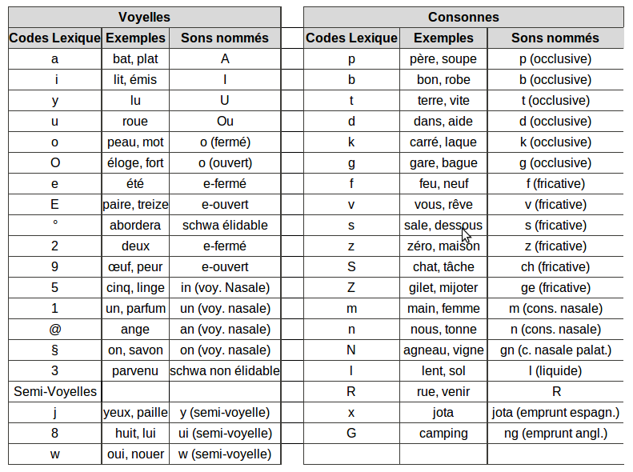

Ce document présente les fréquences des unités sous-lexicales des mots français (lettres, bigrammes, trigrammes, ...) estimées à partir de la base lexicale [Lexique](http://www.lexique.org).

```{r, include=FALSE}
require(DT)
```


# Chargement de Lexique382

```{r load_datatable}
source('https://raw.githubusercontent.com/chrplr/openlexicon/master/datasets-info/fetch_datasets.R')
lexique <- get_lexique382()
```


# Orthographe

Nous commençons par calculer la fréquence des lettres (en pourcentage) dans les représentations orthographiques. Le calcul est pondéré par la fréquence formelle des mots estimée dans le corpus de livres utilisé pour constituer Lexique (`freqlivres`) (Note: le code peut aisement être modifié pour utiliser les fréquences estimées à partir des sous-titres de films, `freqfilms2`)

## Lettres

```{r letters}
chars <- list()

for (i in 1:nrow(lexique))
{ 
  item <- lexique$ortho[i]
  if (!is.null(item)) {
  for (c in strsplit(item, '')[[1]]) 
  {
    if (is.null(chars[[c]])) { 
      chars[[c]] = lexique$freqlivres[i]
    } else {
        chars[[c]] <-  chars[[c]] + lexique$freqlivres[i]
    }
  }
  }
}

charfreq = unlist(chars)
charfreq = 100 * charfreq / sum(charfreq)
options(digits=3, scipen=4)
freq_lettres <- data.frame(freq=sort(charfreq, decreasing = T))
datatable(freq_lettres)
```

## Bigrammes

Pour le calcul des bigrammes, nous ajoutons les symboles '`^`' en début de mot, et '`$`' en fin de mot. 

```{r bigrammes}
bigrammes <- function(chaine)
 { 
   x <- paste("^", chaine, "$", sep="")
   bg <- list()
   for (i in 1:(stringr::str_length(x)-1))
     bg[[i]] <- stringr::str_sub(x, i, i + 1)
   bg
}

bg <- list()

for (i in 1:nrow(lexique))
{ 
  item <- lexique$ortho[i]
  if (!is.null(item)) {
  for (c in bigrammes(item)) 
  {
    if (is.null(bg[[c]])) { 
      bg[[c]] = lexique$freqlivres[i]
    } else {
        bg[[c]] <-  bg[[c]] + lexique$freqlivres[i]
    }
  }
  }
}

bgfreq = unlist(bg)
bgfreq = 100 * bgfreq / sum(bgfreq)
freq_bigrammes <- data.frame(freq=sort(bgfreq, decreasing = T))
datatable(freq_bigrammes)
```

## Trigrammes

Le calcul des fréquences des trigrammes s'effectue de manière simulaire à celui des bigrammes.

```{r trigrammes}
trigammes <- function(chaine)
 { 
   x <- paste("^", chaine, "$", sep="")
   trig <- list()
   for (i in 1:(stringr::str_length(x)-2))
     trig[[i]] <- stringr::str_sub(x, i, i + 2)
   trig
}

trig <- list()

for (i in 1:nrow(lexique))
{ 
  item <- lexique$ortho[i]
  if (!is.null(item)) {
  for (c in trigammes(item)) 
  {
    if (is.null(trig[[c]])) { 
      trig[[c]] = lexique$freqlivres[i]
    } else {
        trig[[c]] <-  trig[[c]] + lexique$freqlivres[i]
    }
  }
  }
}

trigfreq = unlist(trig)
trigfreq = 100 * trigfreq / sum(trigfreq)
freq_trigrammes <- data.frame(freq=sort(trigfreq, decreasing = T))
datatable(freq_trigrammes)
```

## Quadrigrammes

```{r quadrigrammes}
quadrigammes <- function(chaine)
 { 
   x <- paste("^", chaine, "$", sep="")
   quadrig <- list()
   for (i in 1:(stringr::str_length(x)-3))
     quadrig[[i]] <- stringr::str_sub(x, i, i + 3)
   quadrig
}

quadrig <- list()

for (i in 1:nrow(lexique))
{ 
  item <- lexique$ortho[i]
  if (!is.null(item) && (stringr::str_length(item) > 1)) {
  for (c in quadrigammes(item)) 
  {
    if (is.null(quadrig[[c]])) { 
      quadrig[[c]] = lexique$freqlivres[i]
    } else {
        quadrig[[c]] <-  quadrig[[c]] + lexique$freqlivres[i]
    }
  }
  }
}

quadrigfreq = unlist(quadrig)
quadrigfreq = 100 * quadrigfreq / sum(quadrigfreq)
freq_quadrigrammes <- data.frame(freq=sort(quadrigfreq, decreasing = T))
datatable(freq_quadrigrammes)
```

## Sauvegarde des tables

```{r}
allortho <- rbind(data.frame(freq_lettres, type='lettre'), data.frame(freq_bigrammes, type='bigram'), data.frame(freq_trigrammes, type='trigramme'), data.frame(freq_quadrigrammes, type='quadrigramme'))

saveRDS(allortho, file='French-freq-sublex-ortho.rds')
```


# Phonétique

Il est possible de calculer les fréquences de phones et des syllabes.

Les codes employés pour les représentations phonétiques dans Lexique3 sont les suivants:




# Phones

```{r phones}
phones <- list()

for (i in 1:nrow(lexique))
{ 
  item <- lexique$phon[i]
  if (!is.null(item)) {
  for (c in strsplit(item, '')[[1]]) 
  {
    if (is.null(phones[[c]])) { 
      phones[[c]] = lexique$freqlivres[i]
    } else {
        phones[[c]] <-  phones[[c]] + lexique$freqlivres[i]
    }
  }
  }
}

phonesfreq = unlist(phones)
phonesfreq = 100 * phonesfreq / sum(phonesfreq)
options(digits=3, scipen=4)
freq_phones <- data.frame(freq=sort(phonesfreq, decreasing = T))
datatable(freq_phones)
```

# Syllabes

```{r syllables}
syll <- list()

for (i in 1:nrow(lexique))
{ 
  item <- lexique$syll[i]
  if (!is.null(item)) {
  for (c in strsplit(item, '-')[[1]]) 
  {
    if (is.null(syll[[c]])) { 
      syll[[c]] = lexique$freqlivres[i]
    } else {
        syll[[c]] <-  syll[[c]] + lexique$freqlivres[i]
    }
  }
  }
}

syllfreq = unlist(syll)
syllfreq = 100 * syllfreq / sum(syllfreq)
options(digits=3, scipen=4)
freq_syll <- data.frame(freq=sort(syllfreq, decreasing = T))
datatable(freq_syll)
```

# Sauvegarde des tables


```{r}
allphonetic <- rbind(data.frame(freq_syll, type='syll'), data.frame(freq_phones, type='phone'))

saveRDS(allphonetic, file='French-freq-sublex-phonetic.rds')
```

